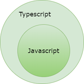
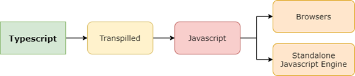
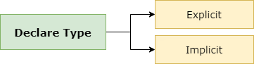

# Belajar Dengan Jenius Typescript


# Table of Contents

- Typescript
  - Node Typing
  - Type Annotations
  - Modules
    - Export 
    - Import - Single Module
    - Import - Entire Module
    - Import - Rename Module
  - Compiling Modules


---


# Typescript

| Parameter                   | Value                                                        | Note |
| --------------------------- | ------------------------------------------------------------ | ---- |
|                             |                                                              |      |
| Typescript Compiler Options | [Click Here](https://www.typescriptlang.org/docs/handbook/compiler-options.html) |      |
|                             |                                                              |      |

Reserved.

**Typescript** adalah sebuah **superset javascript** yang dikembangkan oleh **Microsoft**. **Typescript** juga digunakan dalam sebuah **Open Source Project** yang menginspirasi **Ryan Dahl** bernama **Deno**, sebuah **Runtime Engine** yang dapat digunakan untuk mengeksekusi **Typescript**.



Jika anda melihat gambar di atas pasti faham, setiap **Javascript Code** adalah sebuah **typescript** dan **typerscript** memberikan kelebihan baru untuk **javascript** sehingga seringkali disebut dengan **Extended Javascript**.

*What if we could strengthen JavaScript with the things that are missing for large scale application development, like static typing, classes [and] modules... that’s what TypeScript is about.* 

*—Anders Hejlsberg*

Sebuah program yang ditulis menggunakan **typescript** harus dikompilasi terlebih dahulu kedalam **javascript** agar bisa dieksekusi oleh sebuah **browser** atau **javascript engine**.



Sebagai **superset javascript** kita dapat mengubah setiap **javascript file** ke dalam **typescript file** dengan cara mengubah ekstensinya :


----


## Install

## 

---


Untuk memulai **typescript project**, buatlah sebuah **folder** kemudian eksekusi perintah berikut :

```bash
$ tsc --init
```

Konfigurasi **minimum tsconfig** yang biasa digunakan :

```json
{
  "compilerOptions": {
    "sourceMap": true,
    "outDir": "./dist",
    "strict": true,
    "lib": ["esnext"],
    "esModuleInterop": true
  },
  "include": ["**/*.ts"],
  "exclude": ["node_modules"]
}
```

Selanjutnya eksekusi perintah :

```bash
$ npm init -y
```

Kemudian tambahkan **build command** di dalam **file package.json** :

```json
  "scripts": {
    "build": "npx tsc"
  },
```

Eksekusi dengan perintah berikut :

```bash
$ npx tsc
```


---


## Node Typing

Buatlah file **test.ts** kemudian tulis kode berikut :

```javascript
console.log("Hello World!"); //Prints Hello World!
```

Jika **project** yang kita buat adalah **node applications** maka akan muncul informasi **error** seperti berikut :

```
any
Cannot find name 'console'. Do you need to change your target library? Try changing the 'lib' compiler option to include 'dom'.ts(2584)
```

Jika kita memasang :

```bash
$ npm install @types/node --save-dev
```

Jika kita arahkan **cursor** kita pada **keyword console** maka akan muncul **tooltips** berisi **information** terkait **namespace console** :

```javascript
namespace console
var console: Console
The console module provides a simple debugging console that is similar to the JavaScript console mechanism provided by web browsers.

The module exports two specific components:

A Console class with methods such as console.log(), console.error() andconsole.warn() that can be used to write to any Node.js stream.
A global console instance configured to write to process.stdout and process.stderr. The global console can be used without callingrequire('console').

Warning: The global console object's methods are neither consistently synchronous like the browser APIs they resemble, nor are they consistently asynchronous like all other Node.js streams. See the note on process I/O for more information.

Example using the global console:

console.log('hello world');
// Prints: hello world, to stdout
console.log('hello %s', 'world');
// Prints: hello world, to stdout
console.error(new Error('Whoops, something bad happened'));
// Prints error message and stack trace to stderr:
//   Error: Whoops, something bad happened
//     at [eval]:5:15
//     at Script.runInThisContext (node:vm:132:18)
//     at Object.runInThisContext (node:vm:309:38)
//     at node:internal/process/execution:77:19
//     at [eval]-wrapper:6:22
//     at evalScript (node:internal/process/execution:76:60)
//     at node:internal/main/eval_string:23:3

const name = 'Will Robinson';
console.warn(`Danger ${name}! Danger!`);
// Prints: Danger Will Robinson! Danger!, to stderr
Example using the Console class:

const out = getStreamSomehow();
const err = getStreamSomehow();
const myConsole = new console.Console(out, err);

myConsole.log('hello world');
// Prints: hello world, to out
myConsole.log('hello %s', 'world');
// Prints: hello world, to out
myConsole.error(new Error('Whoops, something bad happened'));
// Prints: [Error: Whoops, something bad happened], to err

const name = 'Will Robinson';
myConsole.warn(`Danger ${name}! Danger!`);
// Prints: Danger Will Robinson! Danger!, to err
@see — source
```

Jika project yang kita buat adalah web applications di dalam browser tambahkan konfigurasi berikut dalam **tsconfig**  :

```json
        "lib": [
            "es6",
            "dom"    <------- Add this "dom" here
        ],
```


---


## Type Annotations

**Typescript** menggunakan **Type Annotations** untuk memberikan informasi tipe data secara eksplisit pada sebuah **identifier**.  Ketika suatu **identifier**, baik itu sebuah **variable**, **function**, atau **object** telah diberikan sebuah **annotations** maka **identifier** tersebut hanya dapat menggunakan **data type** yang telah diberikan. 

**Typescript** hadir agar kita melakukan **Static Typing** terlebih dahulu sehingga mencegah kita untuk membuat sebuah **generic variable**. Jika kita melakukan pengembangan aplikasi menggunakan **Deno runtime** yang telah menggunakan **typescript** maka kita akan menggunakan **type annotation** setiap kali kita membuat sebuah **identifier**.

Saat kita mendeklarasikan suatu variabel dalam **typescript** kita harus menambahkan sebuah **colon** dan **type annotation**. Di bawah ini adalah **type annotation** yang tersedia di dalam **typescript** :


Untuk mendeklarasikan data tipe pada suatu variabel kita dapat melakukannya secara **explicit** atau **implicit** :



---


## Modules

Setiap kode yang kita tulis dalam **typescript** konteksnya langsung berada di dalam **global scope**. Jika kita memiliki beberapa **file** dalam satu **project** maka semua **variable**, **function**, **class** akan diinterpretasikan sebagai satu kesatuan di dalam **global scope**. Kode yang di tulis di dalam salah satu **file** dapat diakses di dalam kode di **file** lainnya.

Jika kita membuat **file1.ts** dengan isi kode berikut :

```javascript
const hello : string = "Hello World!";
```

Di bawah ini adalah **file2.ts** :

```javascript
console.log(hello); //Prints Hello World!

hello = "Hello Maudy!"; // allowed
```

Variabel **hello** dikenali dan diinterpretasikan dalam **global scope**. Aksesibilitas ini bisa menimbulkan masalah karena berpotensi termodifikasi dan tertimpa (**overriden**) tanpa diketahui sama sekali. Hal ini sangat berbahaya karena bisa menimbulkan konflik dan **error** pada **project typescript** yang kita bangun. 

Untuk mengatasi permasalahan ini **typescript** menyediakan konsep **modules** dan **namespaces** untuk mencegah suatu kode berada dalam konteks **global scope**. Konsep **modules** dan **namespaces** juga membantu untuk kegiatan **maintenance codebase** dalam skala besar.

Tujuan dari **modules** adalah membangun sebuah isolasi dalam konteks **local scope**, sehingga **variable**, **function**, **class** yang di deklarasikan di dalam modules tidak dapat diakses oleh kode yang berada di luar **modules**. Sebuah **module** dapat dibuat menggunakan **keyword export** dan untuk menggunakan sebuah **modules** kita bisa menggunakan **keyword import**.

Dalam **typescript**, sebuah **file** yang berisi **top-level export** atau **import** dianggap sebuah sebuah **modules**. Di bawah ini adalah contoh pembuatan **modules** dalam **file1.ts**:

```javascript
export const hello : string = "Hello World!";
```

Jika **file2.ts** dieksekusi maka akan menimbulkan **error** :  

```javascript
console.log(hello); //Error: cannot find 'hello'

hello = "Hello Maudy!"; // allowed
```


### Export 

Buatlah **file** dengan nama **Employee.ts** :

```typescript
export let age: number = 30;
export class Employee {
  employeeID: number;
  employeeName: string;
  constructor(name: string, code: number) {
    this.employeeName = name;
    this.employeeID = code;
  }
  printEmployee() {
    console.log(
      "Employee ID: " +
        this.employeeID +
        ", Employee Name: " +
        this.employeeName
    );
  }
}
let companyName: string = "The Boring Company";
```


### Import - Single Module

Buatlah file dengan nama MainEmployee.ts, kemudian tulis contoh kode seperti pada di bawah ini :

```typescript
import { Employee } from "./Employee";

let employeeObject = new Employee("Gun Gun Febrianza", 1);
employeeObject.printEmployee();
```

Di atas adalah contoh **single module import** untuk menggunakan sebuah **modules**.


### Import - Entire Module

Di bawah ini adalah contoh **entire modules import** untuk menggunakan sebuah **modules** :

```typescript
import * as EMP from "./Employee";

let employeeObject = new EMP.Employee("Gun Gun Febrianza", 1);
employeeObject.printEmployee();
```


### Import - Rename Module

Di bawah ini adalah contoh **renaming imported module** untuk menggunakan sebuah **modules** :

```typescript
import { Employee as manpower } from "./Employee";

let employeeObject = new manpower("Gun Gun Febrianza", 1);
employeeObject.printEmployee();
```


## Compiling Modules

Untuk kompilasi **modules** kita harus menentukan dulu **target environment** yang kita inginkan, terdapat beberapa pilihan :

1. None
2. CommonJS
3. AMD
4. UMD
5. System
6. ES6, ES2015, ESNext

Tambahkan **flags** berikut saat melakukan kompilasi **modules** :

```
--module <target environment> <file path>
```

Mengenai **Target Environment** :

- Jika target yang kita inginkan adalah **server-side applications** untuk **node.js** gunakan **CommonJS Module Loader**.
- Jika target yang kita inginkan adalah **client-side applications** dalam **web browser apps** gunakan **AMD Target** yang dapat dimuat dengan **require.js**.
- Jika target yang kita inginkan adalah **server-side** dan **client-side modules** gunakan **UMD Target**.


----


## Time Programming

### ISO 8601

**ISO 8601** adalah standar internasional yang digunakan untuk memaparkan komunikasi data terkait tanggal dan waktu (**date & time**). Di bawah ini adalah format yang diekspresikan menggunakan **ISO 8601** :

|                    |                           |
| ------------------ | ------------------------- |
| Date               | 2022-06-23                |
| Date & Time in UTC | 2022-06-23T03:02:50+00:00 |
|                    | 2022-06-23T03:02:50Z      |
|                    | 20220623T030250Z          |
| Week               | 2022-W25                  |
| Week with Weekday  | 2022-W25-4                |
| Ordinal Date       | 2022-174                  |

Dari data di atas **moment.js** dapat melakukan parsing format **ISO 8601** dalam bentuk **string** :

```
2013-02-08  # A calendar date part
2013-02     # A month date part
2013-W06-5  # A week date part
2013-039    # An ordinal date part

20130208    # Basic (short) full date
201303      # Basic (short) year+month
2013        # Basic (short) year only
2013W065    # Basic (short) week, weekday
2013W06     # Basic (short) week only
2013050     # Basic (short) ordinal date (year + day-of-year)
```

Data waktu (**time part**) juga bisa diberikan, terpisah dari tanggal (**date**) menggunakan spasi atau simbol huruf T  :

```
2013-02-08T09            # An hour time part separated by a T
2013-02-08 09            # An hour time part separated by a space
2013-02-08 09:30         # An hour and minute time part
2013-02-08 09:30:26      # An hour, minute, and second time part
2013-02-08 09:30:26.123  # An hour, minute, second, and millisecond time part
2013-02-08 24:00:00.000  # hour 24, minute, second, millisecond equal 0 means next day at midnight

20130208T080910,123      # Short date and time up to ms, separated by comma
20130208T080910.123      # Short date and time up to ms
20130208T080910          # Short date and time up to seconds
20130208T0809            # Short date and time up to minutes
20130208T08              # Short date and time, hours only
```

Secara bawaan moment melakukan parsing dan menampilkan waktu berdasarkan **local time** :


---


### Browser Inconsistent

Di bawah ini adalah data terkait **Javascript Date Parsing** secara **cross-browser** masih inkonsisten :

https://dygraphs.com/date-formats.html

