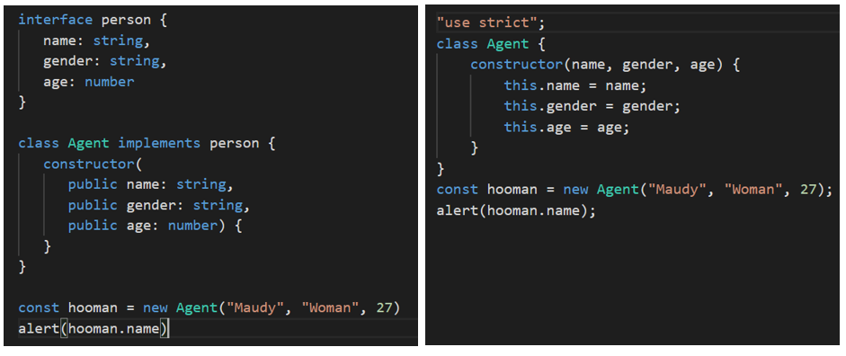

# Belajar Dengan Jenius Typescript


# Table of Contents

- [Typescript](https://github.com/gungunfebrianza/Belajar-Dengan-Jenius-Typescript#typescript)
  - [Why Typescript?](https://github.com/gungunfebrianza/Belajar-Dengan-Jenius-Typescript#why-typescript)
    - Compilation
    - Static Typing
    - Typescript Compiler
    - Transpillation
    - Compiler Options
  - [New Features?](https://github.com/gungunfebrianza/Belajar-Dengan-Jenius-Typescript#new-features-)
    - JSDoc Name Suggestion
    - New File Extensions
    - CommonJS Interoperability
  - [Node Typing](https://github.com/gungunfebrianza/Belajar-Dengan-Jenius-Typescript#node-typing)
  - [Type Annotations](https://github.com/gungunfebrianza/Belajar-Dengan-Jenius-Typescript#type-annotations)
    - [Declare Explicit](https://github.com/gungunfebrianza/Belajar-Dengan-Jenius-Typescript#declare-explicit)
    - [Declare Implicit](https://github.com/gungunfebrianza/Belajar-Dengan-Jenius-Typescript#declare-implicit)
  - [Object](https://github.com/gungunfebrianza/Belajar-Dengan-Jenius-Typescript#object)
    - [Fundamental Objects](https://github.com/gungunfebrianza/Belajar-Dengan-Jenius-Typescript#fundamental-objects)
    - [Custom Object Types](https://github.com/gungunfebrianza/Belajar-Dengan-Jenius-Typescript#custom-object-types)
      - [Type Template](https://github.com/gungunfebrianza/Belajar-Dengan-Jenius-Typescript#type-template)
      - [Type Alias](https://github.com/gungunfebrianza/Belajar-Dengan-Jenius-Typescript#type-alias)
      - [Interface](https://github.com/gungunfebrianza/Belajar-Dengan-Jenius-Typescript#interface)
      - Mutable Properties
      - [Object De-structure](https://github.com/gungunfebrianza/Belajar-Dengan-Jenius-Typescript#object-destructure)
      - [Dynamic Properties](https://github.com/gungunfebrianza/Belajar-Dengan-Jenius-Typescript#dynamic-properties)
        - Index Type Signature
        - Record Type
      - [Optional Properties](https://github.com/gungunfebrianza/Belajar-Dengan-Jenius-Typescript#optional-properties)
      - Read Only Properties
      - [Complex Object Types](https://github.com/gungunfebrianza/Belajar-Dengan-Jenius-Typescript#complex-object-types)
    - [Object Comparison](https://github.com/gungunfebrianza/Belajar-Dengan-Jenius-Typescript#object-comparison)
      - Referential Equality
      - Property Comparison
      - Shallow Equality
      - Deep Equality
  - [Interface](https://github.com/gungunfebrianza/Belajar-Dengan-Jenius-Typescript#interface-1) 
    - [Extending Types](https://github.com/gungunfebrianza/Belajar-Dengan-Jenius-Typescript#extends)
  - [Modules](https://github.com/gungunfebrianza/Belajar-Dengan-Jenius-Typescript#modules)
    - Export 
    - Import - Single Module
    - Import - Entire Module
    - Import - Rename Module
  - Compiling Modules


---


# Typescript

Last Touched 3-7-2022.

| Parameter                              | Value                                                        | Note |
| -------------------------------------- | ------------------------------------------------------------ | ---- |
| Official Website                       | [Click Here](https://www.typescriptlang.org/)                |      |
| Announcing Typescript 4.8 Beta Version | [Click Here](https://devblogs.microsoft.com/typescript/announcing-typescript-4-8-beta/) |      |
| Release Note Typescript 4.7            | [Click Here](https://www.typescriptlang.org/docs/handbook/release-notes/typescript-4-7.html) |      |
| Typescript Blog                        | [Click Here](https://devblogs.microsoft.com/typescript/)     |      |
| Typescript Compiler Options            | [Click Here](https://www.typescriptlang.org/docs/handbook/compiler-options.html) |      |
|                                        |                                                              |      |
|                                        |                                                              |      |

**Typescript** adalah sebuah **superset javascript** yang dikembangkan oleh **Microsoft**. **Typescript** juga digunakan dalam sebuah **Open Source Project** yang menginspirasi **Ryan Dahl** bernama **Deno**, sebuah **Runtime Engine** yang dapat digunakan untuk mengeksekusi **Typescript**.


Jika anda melihat gambar di atas pasti faham, setiap **Javascript Code** adalah sebuah **typescript** dan **typerscript** memberikan kelebihan baru untuk **javascript** sehingga seringkali disebut dengan **Extended Javascript**.

*What if we could strengthen JavaScript with the things that are missing for large scale application development, like static typing, classes [and] modules... that’s what TypeScript is about.* 

*—Anders Hejlsberg*

Sebuah program yang ditulis menggunakan **typescript** harus dikompilasi terlebih dahulu kedalam **javascript** agar bisa dieksekusi oleh sebuah **browser** atau **javascript engine**.


Sebagai **superset javascript** kita dapat mengubah setiap **javascript file** ke dalam **typescript file** dengan cara mengubah ekstensinya :


**Typescript** juga menjadi sebuah **superset** atas **EcmaScript** yang menjadi penentu spesifikasi standar penulisan **javascript**. **ES Next** merepresentasikan versi yang akan datang dan versi terakhir dari **EcmaScript**.


Sebagai **superset javascript** apa saja keuntungan yang dapat diberikan oleh **typescript**?


## Why Typescript?


### Compilation

Pada **javascript** kita harus mengeksekusi kode **javascript** terlebih dahulu untuk memastikan bahwa program **javascript** benar benar **valid**. Pada **typescript**, terdapat proses **transpillation**.

Proses **transpillation** dari **typescript** ke dalam **javascript** memberikan kelebihan untuk melakukan **error checking**. **Typescript compiler** akan memeriksa kode dan memproduksi **error** jika terdapat kesalahan. **Error** dapat terdeteksi sebelum kode dieksekusi.


### Static Typing

**Javascript** adalah bahasa yang memiliki karakteristik **dynamic typing**. Sebagai **superset**, **typescript** memberikan kelebihan baru yaitu dukungan karakteristik **static typing**. So, apasih keunggulan dari **static typing** ? 


Setiap kali kita membuat sebuah variabel kita harus menentukan terlebih dahulu tipe data yang akan digunakan. Hal ini melindungi **developer** dari sekumpulan **bug** umum yang sering muncul dan **security flaw** dari kode yang kita tulis. 

Dengan begitu pengembangan **software** menjadi lebih aman, sebagai contoh di bawah ini kita membuat variabel **name** dengan tipe data **number**. Namun kita memberikan literal **string** sehingga kode **javascript** akan gagal saat dikompilasi ke dalam **javascript** :

```typescript
let fullname: number;
fullname = "Maudy Ayunda"; // compile-time error
```


### Typescript Compiler

**Typescript Compiler** adalah program **compiler** yang akan melakukan **transpilling** yaitu konversi **typescript** ke dalam **javascript** dan memastikan kode tidak memiliki **type error**.

Untuk melakukan instalasi **Typescript Compiler** eksekusi perintah di bawah ini :

```bash
$ npm install -g typescript
```

Untuk memastikan **typescript compiler** sudah terpasang eksekusi perintah di bawah ini :

```bash
$ tsc -V
```


### Transpillation

Buatlah sebuah **file** dengan nama **main.ts** kemudian tulis kode dibawah ini :

```typescript
  let fullname: string;
  fullname = "Maudy Ayunda";
```

Untuk melakukan kompilasi eksekusi perintah di bawah ini :

```bash
$ tsc main.ts
```

Maka sebuah **file javascript** akan diproduksi dengan nama **main.js**.


Jika kita bandingkan sebelum dan sesudah kompilasi kita dapat melihat perbedaannya pada gambar di atas. 

Pada kasus yang lebih **advance** struktur penulisan pada **typescript** menjadi lebih rumit namun setiap komponen program yang kita bangun tertata rapih sehingga memiliki **code readability** yang lebih baik. 

Perhatikan gambar di bawah ini :




### Compiler Options

Kita dapat membuat sebuah **pre-configuration** sebelum kompiler melakukan kompilasi, dengan cara membuat sebuah **file tsconfig.json**. Di bawah ini adalah contoh **Compiler Options** :

```json
  {
    "compilerOptions": {
      "baseUrl": "basic",
      "outDir": "./dist",
      "noEmitOnError": true,
      "target": "es5"
    }
  }
```

Selain membuat **pre-configuration** sendiri kita juga dapat memproduksinya menggunakan perintah :

```bash
$ tsc --init
```


#### Option baseURL

Digunakan agar **compiler** mengetahui lokasi **directory** tempat **compiler** akan melakukan **transpillation**. 


#### Option outDir

Digunakan agar **compiler** memproduksi **output target javascript file** ke dalam lokasi **directory** yang kita tentukan.


#### Option noEmitOnError

Pada kode di atas kita menggunakan **noEmitOnError** agar kompiler tidak memproduksi **javascript** jika di kode **typescript** yang ditulis masih terdapat **error**. 


#### Option Target

Target spesifikasi kode **javascript** yang ingin diproduksi, terdapat spesifikasi sebagai berikut :

- ES 3
- ES 5
- ES 2015 ... ES 2020
- ES Next

Jika sudah eksekusi perintah di bawah ini :

```bash
$ tsc
```

Maka kompiler akan mengeksekusi **script** sesuai dengan konfigurasi yang telah diberikan.


#### Option Watch

Jika kita ingin melakukan **watch mode** tambahkan kedalam **tsconfig.json** :

```
"watch" : true
```


#### Option Module

Pada **Typescript** terdapat konsep **Module format** yaitu sebuah **syntax** yang digunakan untuk membuat sebuah **module**. Sebagai contoh pada **Universal Module Definition (UMD)**, **format** ini dapat digunakan di dalam **browser** dan **node.js**.

Pada **Runtime Engine Node.js**, **Module Format** yang digunakan adalah **CommonJS**, cirinya adalah penggunaan **keyword** **require** dan **module.exports** untuk menentukan sebuah **dependencies** dan **modules**.

**Format Module** yang didukung adalah :

1. None
2. CommonJS
3. Node16
4. AMD
5. UMD
6. System
7. ES6, ES2015, ESNext
8. NodeNext

Anda akan mempelajarinya lebih detail pada **Chapter Compiling Modules**.

Pada Typescript terdapat dua format module yang didukung yaitu **node16** dan **nodenext** :

```
{
    "compilerOptions": {
        "module": "node16",
    }
}
```


#### More Options

Untuk mengetahui lebih lengkap **options** yang disediakan kunjungi halaman berikut :

https://www.typescriptlang.org/docs/handbook/compiler-options.html

----


## New Features ?


### JSDoc Name Suggestion

Dengan **JSDoc** kita bisa mendokumentasikan sebuah **parameters function** menggunakan **@param** tag :

```javascript
/**
 * @param x The first operand
 * @param y The second operand
 */
function add(x, y) {
    return x + y;
}
```

Jika komentar yang kita tulis ternyata sudah tidak **update** maka **typescript** sekarang akan memberikan **suggestion** bahwa **JSDoc Comment** sudah tidak lagi relevan dengan fungsi yang telah kita tulis.

```javascript
/**
 * @param x {number} The first operand
 * @param y {number} The second operand
 */
function add(a, b) {
    return a + b;
}
```

Di bawah ini adalah contoh **suggestion** yang diberikan oleh **typescript** :


### New FIle Extension

**Node.js** secara original menggunakan **CommonJS Format Module** dengan ciri penggunakan **keyword require** dan **module.export**. Namun selain **Format Module CommonJS** juga terdapat **EcmaScript Format Module**  dengan ciri penggunaan **keyword import** dan **export**, karena **EcmaScript** menjadi standard maka **Node.js** harus bisa memberikan dukungan untuk **EcmaScript Module**.

**Node.js** akan membaca ekstensi **file .cjs** sebagai **CommonJS Modules** dan **.mjs** sebagai **EcmaScript Modules**.

Semenjak versi **4.7 typescript** telah mendukung dua ekstensi **file** yaitu **.mts** dan **.cts**. Hal ini membuat **typescript** mendukung pembuatan **file declaration** baru dengan ekstensi **d.mts** dan **d.cts**,


### CommonJS Interoperability

**Node.js** memberikan dukungan pada **ES Modules** untuk bisa menggunakan / **Import CommonJS Modules** : 

```typescript
// ./foo.cts
export function helper() {
    console.log("hello world!");
}

// ./bar.mts
import foo from "./foo.cjs";

// prints "hello world!"
foo.helper();
```

Kita juga dapat menggunakan **named export** dari sebuah **CommonJS Module** seperti di bawah ini :

```typescript
// ./foo.cts
export function helper() {
    console.log("hello world!");
}

// ./bar.mts
import { helper } from "./foo.cjs";

// prints "hello world!"
helper();
```


----


## Install

## 

---


Untuk memulai **typescript project**, buatlah sebuah **folder** kemudian eksekusi perintah berikut :

```bash
$ tsc --init
```

Konfigurasi **minimum tsconfig** yang biasa digunakan :

```json
{
  "compilerOptions": {
    "sourceMap": true,
    "outDir": "./dist",
    "strict": true,
    "lib": ["esnext"],
    "esModuleInterop": true
  },
  "include": ["**/*.ts"],
  "exclude": ["node_modules"]
}
```

Selanjutnya eksekusi perintah :

```bash
$ npm init -y
```

Kemudian tambahkan **build command** di dalam **file package.json** :

```json
  "scripts": {
    "build": "npx tsc"
  },
```

Eksekusi dengan perintah berikut :

```bash
$ npx tsc
```


---


## Node Typing

Buatlah file **test.ts** kemudian tulis kode berikut :

```javascript
console.log("Hello World!"); //Prints Hello World!
```

Jika **project** yang kita buat adalah **node applications** maka akan muncul informasi **error** seperti berikut :

```
any
Cannot find name 'console'. Do you need to change your target library? Try changing the 'lib' compiler option to include 'dom'.ts(2584)
```

Jika kita memasang :

```bash
$ npm install @types/node --save-dev
```

Jika kita arahkan **cursor** kita pada **keyword console** maka akan muncul **tooltips** berisi **information** terkait **namespace console** :

```javascript
namespace console
var console: Console
The console module provides a simple debugging console that is similar to the JavaScript console mechanism provided by web browsers.

The module exports two specific components:

A Console class with methods such as console.log(), console.error() andconsole.warn() that can be used to write to any Node.js stream.
A global console instance configured to write to process.stdout and process.stderr. The global console can be used without callingrequire('console').

Warning: The global console object's methods are neither consistently synchronous like the browser APIs they resemble, nor are they consistently asynchronous like all other Node.js streams. See the note on process I/O for more information.

Example using the global console:

console.log('hello world');
// Prints: hello world, to stdout
console.log('hello %s', 'world');
// Prints: hello world, to stdout
console.error(new Error('Whoops, something bad happened'));
// Prints error message and stack trace to stderr:
//   Error: Whoops, something bad happened
//     at [eval]:5:15
//     at Script.runInThisContext (node:vm:132:18)
//     at Object.runInThisContext (node:vm:309:38)
//     at node:internal/process/execution:77:19
//     at [eval]-wrapper:6:22
//     at evalScript (node:internal/process/execution:76:60)
//     at node:internal/main/eval_string:23:3

const name = 'Will Robinson';
console.warn(`Danger ${name}! Danger!`);
// Prints: Danger Will Robinson! Danger!, to stderr
Example using the Console class:

const out = getStreamSomehow();
const err = getStreamSomehow();
const myConsole = new console.Console(out, err);

myConsole.log('hello world');
// Prints: hello world, to out
myConsole.log('hello %s', 'world');
// Prints: hello world, to out
myConsole.error(new Error('Whoops, something bad happened'));
// Prints: [Error: Whoops, something bad happened], to err

const name = 'Will Robinson';
myConsole.warn(`Danger ${name}! Danger!`);
// Prints: Danger Will Robinson! Danger!, to err
@see — source
```

Jika project yang kita buat adalah web applications di dalam browser tambahkan konfigurasi berikut dalam **tsconfig**  :

```json
        "lib": [
            "es6",
            "dom"    <------- Add this "dom" here
        ],
```


---


## Type Annotations

**Typescript** menggunakan **Type Annotations** untuk memberikan informasi tipe data secara eksplisit pada sebuah **identifier**.  Ketika suatu **identifier**, baik itu sebuah **variable**, **function**, atau **object** telah diberikan sebuah **annotations** maka **identifier** tersebut hanya dapat menggunakan **data type** yang telah diberikan. 

**Typescript** hadir agar kita melakukan **Static Typing** terlebih dahulu sehingga mencegah kita untuk membuat sebuah **generic variable**. Jika kita melakukan pengembangan aplikasi menggunakan **Deno runtime** yang telah menggunakan **typescript** maka kita akan menggunakan **type annotation** setiap kali kita membuat sebuah **identifier**.

Saat kita mendeklarasikan suatu variabel dalam **typescript** kita harus menambahkan sebuah **colon** dan **type annotation**. Di bawah ini adalah **type annotation** yang tersedia di dalam **typescript** :


Untuk mendeklarasikan data tipe pada suatu variabel kita dapat melakukannya secara **explicit** atau **implicit** :


### Declare Explicit

Di bawah ini adalah contoh penggunaan **type annotation** pada **primitive data type**. Deklarasi dilakukan secara eksplisit dengan menegaskan tipe data yang diberikan :

```typescript
  const username: string = "Maudy Ayunda";
  const height: number = 167.13;
  const isCute: boolean = true;
```


### Declare Implicit 

Di bawah ini adalah deklarasi tipe data secara implisit, **typescript compiler** akan memberi tipe data otomatis berdasarkan **literal** yang diberikan :

```typescript
  const username = "Maudy Ayunda";
  const height = 167.13;
  const isCute = true;
```


---


# Object

Sebelumnya kita telah mempelajari apa itu **object** dalam konteks **data types**, namun sebelum mengeksplorasi pembuatan dan pemanfaatan **object**. Tahukah anda definisi **object** benar-benar sangat ambigu dalam **javascript** jika kita amati secara detail.

**Object** yang telah kita pelajari sebelumnya adalah sebuah **Fundamental Object** yang menjadi bagian dari **built-in Object** dalam sebuah **javascript engine**.


---


## Fundamental Objects

**Pada dasarnya segala sesuatu yang ada didalam javascript adalah sebuah object,** namun begitu dalam **javascript** terdapat **fundamental object(s)** yang menjadi dasar **object** semua **objects** yang ada di dalam **javascript**. 

Di antaranya adalah :

1. Object
2. Function
3. Boolean
4. Symbol
5. Error
6. EvalError
7. InternalError
8. RangeError
9. ReferenceError
10. SyntaxError
11. TypeError
12. URIError


Sebelumnya kita telah mempelajari cara membuat **function object** menggunakan **function constructor**. **Function** adalah salah satu dari bagian **fundamental object** yang dimiliki oleh **javascript**.


---


## Custom Object Types

**Saya tegaskan sekali lagi pada dasarnya segala sesuatu yang ada didalam javascript adalah sebuah object,** meskipun begitu kita tetap mempunyai kesempatan untuk membuat **custom object** buatan kita sendiri. 


Dalam buku berjudul [belajar dengan Jenius Node.js](https://github.com/gungunfebrianza/Belajar-Dengan-Jenius-Node.js/blob/master/id/C2.Sub7.Object.md#fundamental-object) yang telah saya tulis ada tiga cara membuat **custom object**, menggunakan **Object Initializer**, **Object Constructor**, dan **function style**.


---


### Type Template

Pada **typescript** untuk membuat **object** kita dapat memanfaatkan **type template** :

```typescript
const blockchain: {
  name: string;
  creator: string;
  totalCoin: number;
} = {
  name: "Bitcoin",
  creator: "Satoshi Nakamoto",
  totalCoin: 21000000,
};
```

Pada kode di atas kita akan memberikan terlebih dahulu tipe data yang akan digunakan untuk setiap **properties** dalam **object blockchain**.


### Type Alias

Kita juga dapat membuat **object** menggunakan **type alias** :

```typescript
type TBlockchain = {
  name: string;
  creator: string;
  totalCoin: number;
};

const Type_bitcoin: TBlockchain = {
  name: "Bitcoin",
  creator: "Satoshi Nakamoto",
  totalCoin: 21000000,
};
```


### Interface

Kita juga dapat membuat **object** menggunakan **interface** :

```typescript
interface IBlockchain {
  name: string;
  creator: string;
  totalCoin: number;
}

const Interface_bitcoin: IBlockchain = {
  name: "Bitcoin",
  creator: "Satoshi Nakamoto",
  totalCoin: 21000000,
};
```


### Mutable Properties

Secara **under the hood**, **javascript object** bersifat **mutable** artinya nilai pada **properties** dapat diubah, sebagai contoh pada gambar di bawah ini kita akan mengubah umur maudy.

```typescript
interface IBlockchain {
  name: string;
  creator: string;
  totalCoin: number;
}

const InterfaceBitcoin: IBlockchain = {
  name: "Bitcoin",
  creator: "Satoshi Nakamoto",
  totalCoin: 21000000,
};

console.log(InterfaceBitcoin.creator); //Satoshi Nakamoto
InterfaceBitcoin.creator = "Anonymous";
console.log(InterfaceBitcoin.creator); //Anonymous
```


### Object Destructure

**Javascript** sudah mendukung operasi **destructure** untuk **object literal**, sehingga kita dapat menggunakannya juga dalam **typescript**. Perhatikan contoh kode di bawah ini :

```typescript
const Interface_bitcoin: IBlockchain = {
  name: "Bitcoin",
  creator: "Satoshi Nakamoto",
  totalCoin: 21000000,
};

const { name, creator } = Interface_bitcoin;
console.log(`${name} is invented by ${creator}`);
```


### Dynamic Properties

Ada saatnya kita tidak dapat mengetahui karakteristik **property** dari **object** yang akan kita buat, sehingga diperlukan mekanisme pembuatan **object** yang mendukung **dynamic properties** untuk mengatasinya.

#### Index Type Signature

Kita dapat membuat **dynamic properties** pada suatu **object** menggunakan **Index Type Signature**, perhatikan contoh kode di bawah ini :

```typescript
interface NFT {
  [key: string]: any;
}

const boredAPE: NFT = {};
boredAPE.creator = "Yuga Labs";
boredAPE.builtOn = "Ethereum";
boredAPE.amount = 10000;

console.log(boredAPE); // { creator: 'Yuga Labs', builtOn: 'Ethereum', amount: 10000 }
```

Kita juga bisa mengkombinasikan **Index Type Signature** dan **Interface Property** agar bisa menambahkan **specific properties** yang memaksa harus digunakan ketika **object** diciptakan :

```typescript
interface blockchain {
  [key: string]: any;
  name: string;
}

const Opolygon: blockchain = {
  type: {
    testNet: "Mumbai",
    layer: "Layer2",
  },
  name: "Polygon PoS",
};

console.log(Opolygon); // { type: { testNet: 'Mumbai', layer: 'Layer2' }, name: 'Polygon PoS' }
```

Pada contoh kasus di atas tanpa **property name**, **object Opolygon** tidak dapat dibuat.


#### Record Type

Kita juga dapat menggunakan **Record Type** untuk membuat **object** dengan karakteristik **dynamic properties** :

```typescript
const agent: Record<string, any> = {};
agent.name = "Gun";
agent.age = 30;
agent.skill = ["DevOps", "Blockchain"];

console.log(agent); //{ name: 'Gun', age: 30, skill: [ 'DevOps', 'Blockchain' ] }
```


### Optional Properties

Pada **typescript** kita bisa membuat **optional properties** pada suatu **object**, sehingga kita memiliki opsi untuk bisa menentukan penggunaan **property** dalam **object**  :

```typescript
interface person {
  fullname: "Gun Gun Febrianza";
  twitter: string;
  listCoin: string[];
  bitcoiners?: boolean;
}

const man: person = {
  fullname: "Gun Gun Febrianza",
  twitter: "@daddybitcoin",
  listCoin: ["Bitcoin", "Liquid Bitcoin"],
};

const libertarian: person = {
  fullname: "Gun Gun Febrianza",
  twitter: "@daddybitcoin",
  listCoin: ["Bitcoin", "Liquid Bitcoin"],
  bitcoiners: true,
};

console.log(man);
```


### Read Only Properties

Dalam **typescript** kita bisa membuat **readonly properties**, namun bukan berarti **readonly property** secara mutlak bersifat **immutable** (nilainya tidak dapat diubah sama sekali). Tujuan dari **readonly property** agar saat **development time** nilainya tidak bisa ditulis ulang terutama saat **type-checking**. Pada saat **runtime**, **readonly property** juga tidak akan mempengaruhi **behaviour** dari program yang ditulis.

Di bawah ini adalah contoh manipulasi **readonly properties** melalui **object reference** :

```typescript
interface Person {
  name: string;
  age: number;
  sex: string;
}

interface ReadonlyPerson {
  readonly name: string;
  readonly age: number;
}

let writablePerson: Person = {
  name: "Kodok Zuma Gempal",
  age: 19,
  sex: "male",
};

// works
let readonlyPerson: ReadonlyPerson = writablePerson;

console.log(readonlyPerson.age); // prints '42'
writablePerson.age++;
console.log(readonlyPerson.age); // prints '43'
```


### Extending Types

Anda bisa membaca di kajian tentang [interface](https://github.com/gungunfebrianza/Belajar-Dengan-Jenius-Typescript#extends).


---


### Complex Object Types

Dengan **typescript** kita dapat membuat **complex object type** :

```typescript
type TypeAlias = number[];

let objComplex: {
  a: string[];
  b: (param: string[]) => string[];
  c: { d: boolean; e: TypeAlias };
} = {
  a: ["Hi", "Maudy"],
  b: function (param: string[]): string[] {
    return this.a;
  },
  c: { d: true, e: [22, 33] },
};

console.log(objComplex);
```

Output dari kode di atas adalah :

```
{
  a: [ 'Hi', 'Maudy' ],
  b: [Function: b],
  c: { d: true, e: [ 22, 33 ] }
}
```

Kode di atas dapat disederhanakan menjadi :

```typescript
type TypeAlias = number[];
type ComplexObj = {
    a: string[];
    b: (param: string[]) => string[];
    c: { d: boolean; e: TypeAlias };
};

let objComplex: ComplexObj = {
    a: ["Hi", "Maudy"],
    b: function (param: string[]): string[] {
        return this.a;
    },
    c: { d: true, e: [22, 33] },
};

console.log(objComplex);
```


## Object Comparison

Jika kita melakukan perbandingan dua **object** yang dibuat menggunakan **interface** dan **type alias** maka hasilnya :

```typescript
const blockchain: {
  name: string;
  creator: string;
  totalCoin: number;
} = {
  name: "Bitcoin",
  creator: "Satoshi Nakamoto",
  totalCoin: 21000000,
};

type TBlockchain = {
  name: string;
  creator: string;
  totalCoin: number;
};

const Type_bitcoin: TBlockchain = {
  name: "Bitcoin",
  creator: "Satoshi Nakamoto",
  totalCoin: 21000000,
};

interface IBlockchain {
  name: string;
  creator: string;
  totalCoin: number;
}

const Interface_bitcoin: IBlockchain = {
  name: "Bitcoin",
  creator: "Satoshi Nakamoto",
  totalCoin: 21000000,
};

console.log(typeof blockchain); //object
console.log(blockchain);

console.log(typeof Interface_bitcoin);  //object
console.log(Interface_bitcoin);

console.log(typeof Type_bitcoin); //object
console.log(Type_bitcoin);

console.log(Interface_bitcoin == Type_bitcoin); //false
console.log(Interface_bitcoin === Type_bitcoin); //false
```

Jika kita melakukan perbandingan dua **object** yang dibuat menggunakan **type template** dan **interface** maka hasilnya :

```typescript
console.log(blockchain == Interface_bitcoin); //false
console.log(blockchain === Interface_bitcoin); //false
```

Jika kita melakukan perbandingan dua **object** yang dibuat menggunakan **type alias** dan **type interface** maka hasilnya :

```typescript
console.log(Type_bitcoin == blockchain); //false
console.log(Type_bitcoin === blockchain); //false
```


### Referential Equality 


### Property Comparison 


### Shallow Equality 


### Deep Equality


## Interface


### Extends

Pada **javascript** kita bisa menambahkan **property** baru pada suatu **object** dengan **prototype**, **typescript** menyediakan cara yang lebih elegan untuk menambahkan **property** pada suatu **object** menggunakan **keyword extend** :

```typescript
interface coin extends creator {
  name: string;
  supply: number;
}

interface creator {
  created: string;
  author: "Satoshi Nakamoto";
}

const bitcoin: coin = {
  name: "bitcoin",
  supply: 21000000,
  created: "2009",
  author: "Satoshi Nakamoto",
};

console.log(bitcoin);
```


## Modules

Setiap kode yang kita tulis dalam **typescript** konteksnya langsung berada di dalam **global scope**. Jika kita memiliki beberapa **file** dalam satu **project** maka semua **variable**, **function**, **class** akan diinterpretasikan sebagai satu kesatuan di dalam **global scope**. Kode yang di tulis di dalam salah satu **file** dapat diakses di dalam kode di **file** lainnya.

Jika kita membuat **file1.ts** dengan isi kode berikut :

```javascript
const hello : string = "Hello World!";
```

Di bawah ini adalah **file2.ts** :

```javascript
console.log(hello); //Prints Hello World!

hello = "Hello Maudy!"; // allowed
```

Variabel **hello** dikenali dan diinterpretasikan dalam **global scope**. Aksesibilitas ini bisa menimbulkan masalah karena berpotensi termodifikasi dan tertimpa (**overriden**) tanpa diketahui sama sekali. Hal ini sangat berbahaya karena bisa menimbulkan konflik dan **error** pada **project typescript** yang kita bangun. 

Untuk mengatasi permasalahan ini **typescript** menyediakan konsep **modules** dan **namespaces** untuk mencegah suatu kode berada dalam konteks **global scope**. Konsep **modules** dan **namespaces** juga membantu untuk kegiatan **maintenance codebase** dalam skala besar.

Tujuan dari **modules** adalah membangun sebuah isolasi dalam konteks **local scope**, sehingga **variable**, **function**, **class** yang di deklarasikan di dalam modules tidak dapat diakses oleh kode yang berada di luar **modules**. Sebuah **module** dapat dibuat menggunakan **keyword export** dan untuk menggunakan sebuah **modules** kita bisa menggunakan **keyword import**.

Dalam **typescript**, sebuah **file** yang berisi **top-level export** atau **import** dianggap sebuah sebuah **modules**. Di bawah ini adalah contoh pembuatan **modules** dalam **file1.ts**:

```javascript
export const hello : string = "Hello World!";
```

Jika **file2.ts** dieksekusi maka akan menimbulkan **error** :  

```javascript
console.log(hello); //Error: cannot find 'hello'

hello = "Hello Maudy!"; // allowed
```


### Export 

Buatlah **file** dengan nama **Employee.ts** :

```typescript
export let age: number = 30;
export class Employee {
  employeeID: number;
  employeeName: string;
  constructor(name: string, code: number) {
    this.employeeName = name;
    this.employeeID = code;
  }
  printEmployee() {
    console.log(
      "Employee ID: " +
        this.employeeID +
        ", Employee Name: " +
        this.employeeName
    );
  }
}
let companyName: string = "The Boring Company";
```


### Import - Single Module

Buatlah file dengan nama MainEmployee.ts, kemudian tulis contoh kode seperti pada di bawah ini :

```typescript
import { Employee } from "./Employee";

let employeeObject = new Employee("Gun Gun Febrianza", 1);
employeeObject.printEmployee();
```

Di atas adalah contoh **single module import** untuk menggunakan sebuah **modules**.


### Import - Entire Module

Di bawah ini adalah contoh **entire modules import** untuk menggunakan sebuah **modules** :

```typescript
import * as EMP from "./Employee";

let employeeObject = new EMP.Employee("Gun Gun Febrianza", 1);
employeeObject.printEmployee();
```


### Import - Rename Module

Di bawah ini adalah contoh **renaming imported module** untuk menggunakan sebuah **modules** :

```typescript
import { Employee as manpower } from "./Employee";

let employeeObject = new manpower("Gun Gun Febrianza", 1);
employeeObject.printEmployee();
```


## Compiling Modules

Untuk kompilasi **modules** kita harus menentukan dulu **target environment** yang kita inginkan, terdapat beberapa pilihan :

1. None
2. CommonJS
3. Node16
4. AMD
5. UMD
6. System
7. ES6, ES2015, ESNext
8. NodeNext

Tambahkan **flags** berikut saat melakukan kompilasi **modules** :

```
--module <target environment> <file path>
```

Mengenai **Target Environment** :

- Jika target yang kita inginkan adalah **server-side applications** untuk **node.js** gunakan **CommonJS Module Loader**.
- Jika target yang kita inginkan adalah **client-side applications** dalam **web browser apps** gunakan **AMD Target** yang dapat dimuat dengan **require.js**.
- Jika target yang kita inginkan adalah **server-side** dan **client-side modules** gunakan **UMD Target**.


----


## Time Programming

### ISO 8601

**ISO 8601** adalah standar internasional yang digunakan untuk memaparkan komunikasi data terkait tanggal dan waktu (**date & time**). Di bawah ini adalah format yang diekspresikan menggunakan **ISO 8601** :

|                    |                           |
| ------------------ | ------------------------- |
| Date               | 2022-06-23                |
| Date & Time in UTC | 2022-06-23T03:02:50+00:00 |
|                    | 2022-06-23T03:02:50Z      |
|                    | 20220623T030250Z          |
| Week               | 2022-W25                  |
| Week with Weekday  | 2022-W25-4                |
| Ordinal Date       | 2022-174                  |

Dari data di atas **moment.js** dapat melakukan parsing format **ISO 8601** dalam bentuk **string** :

```
2013-02-08  # A calendar date part
2013-02     # A month date part
2013-W06-5  # A week date part
2013-039    # An ordinal date part

20130208    # Basic (short) full date
201303      # Basic (short) year+month
2013        # Basic (short) year only
2013W065    # Basic (short) week, weekday
2013W06     # Basic (short) week only
2013050     # Basic (short) ordinal date (year + day-of-year)
```

Data waktu (**time part**) juga bisa diberikan, terpisah dari tanggal (**date**) menggunakan spasi atau simbol huruf T  :

```
2013-02-08T09            # An hour time part separated by a T
2013-02-08 09            # An hour time part separated by a space
2013-02-08 09:30         # An hour and minute time part
2013-02-08 09:30:26      # An hour, minute, and second time part
2013-02-08 09:30:26.123  # An hour, minute, second, and millisecond time part
2013-02-08 24:00:00.000  # hour 24, minute, second, millisecond equal 0 means next day at midnight

20130208T080910,123      # Short date and time up to ms, separated by comma
20130208T080910.123      # Short date and time up to ms
20130208T080910          # Short date and time up to seconds
20130208T0809            # Short date and time up to minutes
20130208T08              # Short date and time, hours only
```

Secara bawaan moment melakukan parsing dan menampilkan waktu berdasarkan **local time** :


---


### Browser Inconsistent

Di bawah ini adalah data terkait **Javascript Date Parsing** secara **cross-browser** masih inkonsisten :

https://dygraphs.com/date-formats.html

